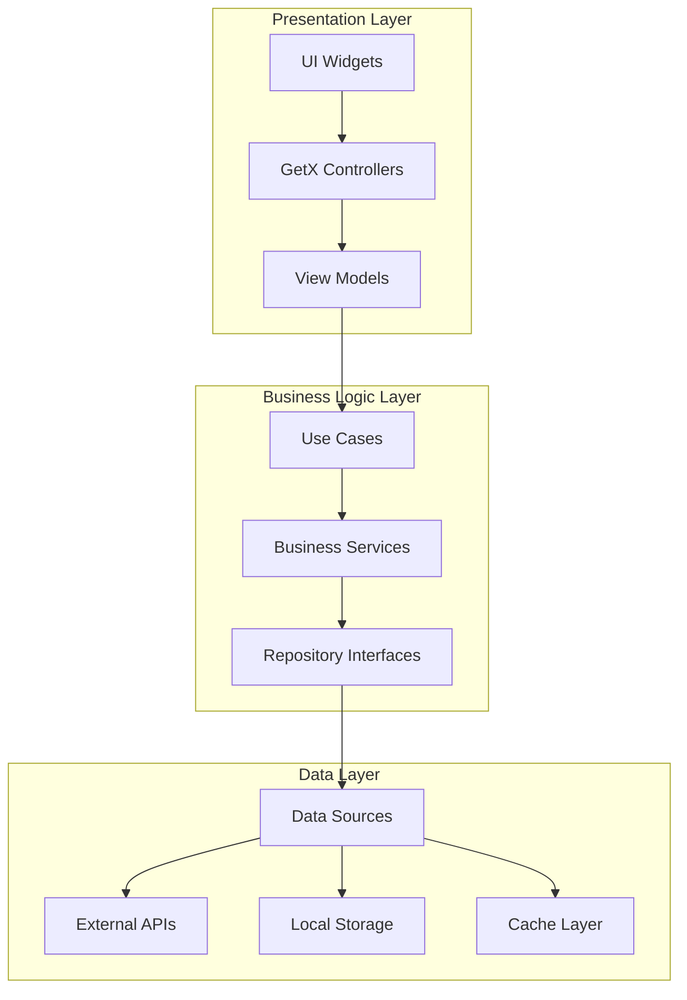
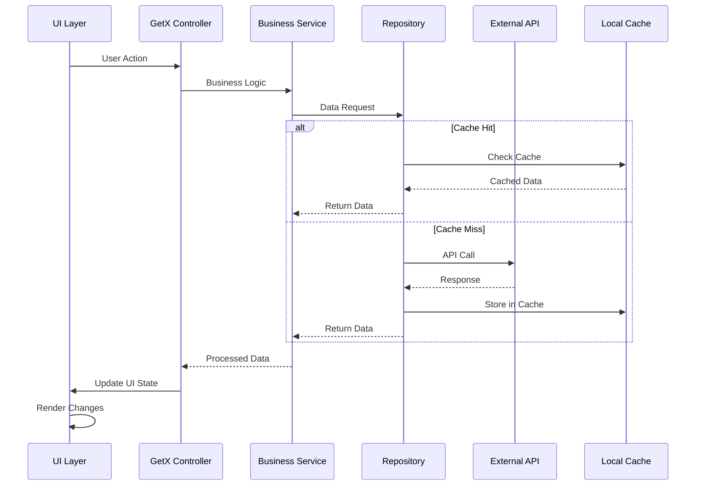
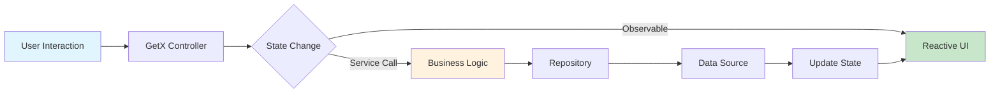
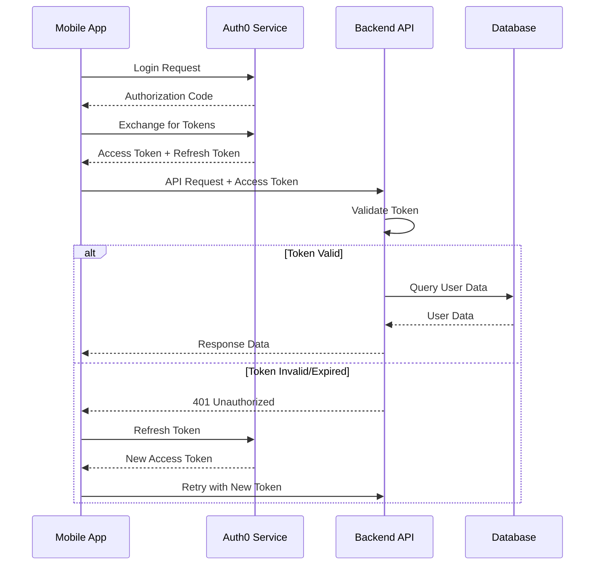

# 🏗️ EasiBites Technical Architecture

## 📋 Table of Contents
- [System Overview](#system-overview)
- [Architecture Patterns](#architecture-patterns)
- [Technology Stack](#technology-stack)
- [Project Structure](#project-structure)
- [Data Flow](#data-flow)
- [State Management](#state-management)
- [API Integration](#api-integration)
- [Security Implementation](#security-implementation)
- [Performance Optimizations](#performance-optimizations)
- [Testing Strategy](#testing-strategy)

## 🎯 System Overview

EasiBites is a Flutter-based mobile application designed to help users with dietary restrictions safely navigate restaurant menus. The app employs modern architectural patterns and cutting-edge technologies to deliver a seamless, secure, and performant user experience.

### Core Objectives
- **Safety First**: 97% accuracy in allergen detection
- **User Experience**: Intuitive interface with <3s load times
- **Scalability**: Support for 10,000+ concurrent users
- **Accessibility**: WCAG 2.1 AA compliance
- **Security**: End-to-end encryption and GDPR compliance

## 🏛️ Architecture Patterns

### Clean Architecture Implementation



### MVVM with GetX Pattern

```dart
// Example: Restaurant Controller Implementation
class RestaurantController extends GetxController {
  final RestaurantRepository _repository;
  final AllergenService _allergenService;
  
  final RxList<Restaurant> _restaurants = <Restaurant>[].obs;
  final RxBool _isLoading = false.obs;
  final RxString _searchQuery = ''.obs;
  
  List<Restaurant> get restaurants => _restaurants.value;
  bool get isLoading => _isLoading.value;
  
  @override
  void onInit() {
    super.onInit();
    _initializeData();
    _setupSearchListener();
  }
  
  void _setupSearchListener() {
    debounce(_searchQuery, (query) {
      _searchRestaurants(query);
    }, time: const Duration(milliseconds: 500));
  }
  
  Future<void> _searchRestaurants(String query) async {
    try {
      _isLoading.value = true;
      final results = await _repository.searchRestaurants(
        query: query,
        userLocation: Get.find<LocationService>().currentLocation,
        allergenFilters: Get.find<UserService>().userAllergens,
      );
      _restaurants.value = results;
    } catch (e) {
      _handleError(e);
    } finally {
      _isLoading.value = false;
    }
  }
}
```

## 🛠️ Technology Stack

### Frontend Framework
- **Flutter 3.7.2**: Cross-platform UI framework
- **Dart 3.0**: Programming language with null safety
- **Material Design 3**: Google's latest design system

### State Management
- **GetX 4.7.2**: Reactive state management and dependency injection
- **GetX Bindings**: Automatic dependency resolution
- **GetX Services**: Singleton service management

### Backend & APIs
- **Firebase Suite**: Authentication, analytics, crash reporting
- **Auth0**: Enterprise-grade authentication
- **RESTful APIs**: HTTP-based service communication
- **GraphQL**: Efficient data fetching (planned v2.0)

### Data Storage
- **SharedPreferences**: Simple key-value storage
- **Flutter Secure Storage**: Encrypted sensitive data
- **Hive**: Fast NoSQL database for offline support
- **SQLite**: Relational database for complex queries

### Development Tools
- **VS Code**: Primary IDE with Flutter extensions
- **Android Studio**: Android-specific development
- **Xcode**: iOS development and testing
- **Firebase Console**: Backend service management

## 📁 Project Structure

```
lib/
├── 🎯 main.dart                    # Application entry point
├── 🔧 firebase_options.dart        # Firebase configuration
├── 📱 models/                      # Data models and entities
│   ├── user_model.dart
│   ├── restaurant_model.dart
│   ├── allergen_model.dart
│   └── activity_model.dart
├── 📺 screens/                     # UI screens and pages
│   ├── auth/
│   │   ├── login_page.dart
│   │   ├── onboarding_page.dart
│   │   └── auth_service.dart
│   ├── home/
│   │   ├── home_screen.dart
│   │   ├── home_main.dart
│   │   └── launch_page.dart
│   ├── restaurants/
│   │   ├── menu_screen.dart
│   │   ├── scan_menu_page.dart
│   │   └── menu_analysis_page.dart
│   ├── profile/
│   │   ├── profile_page.dart
│   │   └── MyProfilePage.dart
│   └── groups/
│       ├── MyGroupsScreen.dart
│       └── group_invites.dart
├── 🎮 ViewModel/                   # Business logic controllers
│   ├── auth_controller.dart
│   ├── user_controller.dart
│   ├── restaurant_controller.dart
│   └── group_controller.dart
├── 🧩 widgets/                     # Reusable UI components
│   ├── common/
│   ├── forms/
│   ├── cards/
│   └── animations/
├── 🔧 services/                    # Business services
│   ├── api_service.dart
│   ├── location_service.dart
│   ├── allergen_service.dart
│   └── notification_service.dart
├── 🗃️ repositories/               # Data access layer
│   ├── user_repository.dart
│   ├── restaurant_repository.dart
│   └── cache_repository.dart
├── 🌐 network/                     # Network layer
│   ├── api_client.dart
│   ├── interceptors.dart
│   └── error_handler.dart
├── 🎨 themes/                      # UI themes and styling
│   ├── app_theme.dart
│   ├── colors.dart
│   └── text_styles.dart
├── 🔧 utils/                       # Utility functions
│   ├── constants.dart
│   ├── helpers.dart
│   └── validators.dart
└── 🌍 l10n/                       # Internationalization
    ├── app_localizations.dart
    └── translations/
```

## 🔄 Data Flow Architecture

### Request-Response Flow



### State Management Flow



## 🎛️ State Management Deep Dive

### GetX Reactive Programming

```dart
// Observable State Management
class UserController extends GetxController {
  // Reactive variables automatically trigger UI updates
  final Rx<User?> _currentUser = Rxn<User>();
  final RxList<String> _allergens = <String>[].obs;
  final RxBool _isProfileComplete = false.obs;
  
  // Getters for accessing reactive state
  User? get currentUser => _currentUser.value;
  List<String> get allergens => _allergens.toList();
  bool get isProfileComplete => _isProfileComplete.value;
  
  // Computed values that automatically update
  String get displayName => 
    currentUser?.displayName ?? 'Guest User';
  
  bool get hasAllergens => _allergens.isNotEmpty;
  
  // Methods that update state
  void updateAllergens(List<String> newAllergens) {
    _allergens.assignAll(newAllergens);
    _checkProfileCompletion();
  }
  
  void _checkProfileCompletion() {
    _isProfileComplete.value = 
      currentUser != null && 
      _allergens.isNotEmpty &&
      currentUser!.profilePicture != null;
  }
  
  // Reactive workers for side effects
  @override
  void onInit() {
    super.onInit();
    
    // React to user changes
    ever(_currentUser, (User? user) {
      if (user != null) {
        _loadUserPreferences();
      }
    });
    
    // Debounce allergen updates
    debounce(_allergens, (List<String> allergens) {
      _saveAllergens(allergens);
    }, time: const Duration(seconds: 1));
  }
}
```

### Dependency Injection

```dart
// Service Bindings
class InitialBinding extends Bindings {
  @override
  void dependencies() {
    // Lazy singletons - created when first accessed
    Get.lazyPut<ApiClient>(() => ApiClient());
    Get.lazyPut<AuthService>(() => AuthService());
    Get.lazyPut<LocationService>(() => LocationService());
    
    // Permanent singletons - never disposed
    Get.put<UserController>(UserController(), permanent: true);
    Get.put<ThemeController>(ThemeController(), permanent: true);
    
    // Factories - new instance each time
    Get.lazyPut<RestaurantRepository>(
      () => RestaurantRepositoryImpl(),
      fenix: true, // Can be recreated
    );
  }
}
```

## 🌐 API Integration Strategy

### HTTP Client Configuration

```dart
class ApiClient {
  late final Dio _dio;
  
  ApiClient() {
    _dio = Dio(BaseOptions(
      baseUrl: Config.apiBaseUrl,
      connectTimeout: const Duration(seconds: 10),
      receiveTimeout: const Duration(seconds: 15),
      headers: {
        'Content-Type': 'application/json',
        'Accept': 'application/json',
      },
    ));
    
    _setupInterceptors();
  }
  
  void _setupInterceptors() {
    // Request interceptor for auth tokens
    _dio.interceptors.add(AuthInterceptor());
    
    // Response interceptor for error handling
    _dio.interceptors.add(ErrorInterceptor());
    
    // Logging interceptor for debugging
    if (kDebugMode) {
      _dio.interceptors.add(LogInterceptor(
        requestBody: true,
        responseBody: true,
      ));
    }
    
    // Cache interceptor for offline support
    _dio.interceptors.add(CacheInterceptor());
  }
}
```

### Error Handling Strategy

```dart
class ErrorInterceptor extends Interceptor {
  @override
  void onError(DioException err, ErrorInterceptorHandler handler) {
    final errorResponse = _handleError(err);
    
    // Show user-friendly error messages
    if (errorResponse.shouldShowToUser) {
      Get.find<NotificationService>().showError(
        errorResponse.userMessage,
      );
    }
    
    // Log technical details for debugging
    Logger.error('API Error', {
      'url': err.requestOptions.uri.toString(),
      'method': err.requestOptions.method,
      'statusCode': err.response?.statusCode,
      'error': err.message,
    });
    
    handler.next(err);
  }
  
  ApiErrorResponse _handleError(DioException error) {
    switch (error.type) {
      case DioExceptionType.connectionTimeout:
        return ApiErrorResponse(
          userMessage: 'Connection timeout. Please check your internet.',
          shouldShowToUser: true,
        );
      case DioExceptionType.receiveTimeout:
        return ApiErrorResponse(
          userMessage: 'Server is taking too long to respond.',
          shouldShowToUser: true,
        );
      case DioExceptionType.badResponse:
        return _handleHttpError(error.response!);
      default:
        return ApiErrorResponse(
          userMessage: 'Something went wrong. Please try again.',
          shouldShowToUser: true,
        );
    }
  }
}
```

## 🔒 Security Implementation

### Authentication Flow



### Data Encryption

```dart
class SecurityService {
  static const String _keyAlias = 'easibites_master_key';
  
  // Encrypt sensitive data before storage
  static Future<String> encryptData(String data) async {
    final key = await _getMasterKey();
    final encrypter = Encrypter(AES(key));
    final iv = IV.fromSecureRandom(16);
    
    final encrypted = encrypter.encrypt(data, iv: iv);
    return '${iv.base64}:${encrypted.base64}';
  }
  
  // Decrypt sensitive data after retrieval
  static Future<String> decryptData(String encryptedData) async {
    final parts = encryptedData.split(':');
    final iv = IV.fromBase64(parts[0]);
    final encrypted = Encrypted.fromBase64(parts[1]);
    
    final key = await _getMasterKey();
    final encrypter = Encrypter(AES(key));
    
    return encrypter.decrypt(encrypted, iv: iv);
  }
  
  static Future<Key> _getMasterKey() async {
    // Generate or retrieve encryption key from secure storage
    const secureStorage = FlutterSecureStorage();
    String? keyString = await secureStorage.read(key: _keyAlias);
    
    if (keyString == null) {
      final key = Key.fromSecureRandom(32);
      await secureStorage.write(key: _keyAlias, value: key.base64);
      return key;
    }
    
    return Key.fromBase64(keyString);
  }
}
```

## ⚡ Performance Optimizations

### Memory Management

```dart
class MemoryOptimizedImageWidget extends StatefulWidget {
  final String imageUrl;
  final double? width;
  final double? height;
  
  const MemoryOptimizedImageWidget({
    Key? key,
    required this.imageUrl,
    this.width,
    this.height,
  }) : super(key: key);
  
  @override
  State<MemoryOptimizedImageWidget> createState() => 
      _MemoryOptimizedImageWidgetState();
}

class _MemoryOptimizedImageWidgetState 
    extends State<MemoryOptimizedImageWidget> {
  
  @override
  Widget build(BuildContext context) {
    return CachedNetworkImage(
      imageUrl: widget.imageUrl,
      width: widget.width,
      height: widget.height,
      fit: BoxFit.cover,
      
      // Memory optimization
      memCacheWidth: widget.width?.toInt(),
      memCacheHeight: widget.height?.toInt(),
      maxWidthDiskCache: 1000,
      maxHeightDiskCache: 1000,
      
      // Progressive loading
      progressIndicatorBuilder: (context, url, progress) =>
          CircularProgressIndicator(value: progress.progress),
      
      // Error handling
      errorWidget: (context, url, error) =>
          const Icon(Icons.error, color: Colors.red),
      
      // Fade animation
      fadeInDuration: const Duration(milliseconds: 300),
    );
  }
}
```

### Lazy Loading Implementation

```dart
class LazyListView<T> extends StatefulWidget {
  final Future<List<T>> Function(int page, int pageSize) loadItems;
  final Widget Function(BuildContext context, T item) itemBuilder;
  final int pageSize;
  
  const LazyListView({
    Key? key,
    required this.loadItems,
    required this.itemBuilder,
    this.pageSize = 20,
  }) : super(key: key);
  
  @override
  State<LazyListView<T>> createState() => _LazyListViewState<T>();
}

class _LazyListViewState<T> extends State<LazyListView<T>> {
  final List<T> _items = [];
  final ScrollController _scrollController = ScrollController();
  bool _isLoading = false;
  bool _hasMoreData = true;
  int _currentPage = 0;
  
  @override
  void initState() {
    super.initState();
    _scrollController.addListener(_onScroll);
    _loadInitialItems();
  }
  
  void _onScroll() {
    if (_scrollController.position.pixels >=
        _scrollController.position.maxScrollExtent - 200) {
      _loadMoreItems();
    }
  }
  
  Future<void> _loadMoreItems() async {
    if (_isLoading || !_hasMoreData) return;
    
    setState(() => _isLoading = true);
    
    try {
      final newItems = await widget.loadItems(_currentPage, widget.pageSize);
      
      setState(() {
        _items.addAll(newItems);
        _currentPage++;
        _hasMoreData = newItems.length == widget.pageSize;
        _isLoading = false;
      });
    } catch (e) {
      setState(() => _isLoading = false);
      // Handle error
    }
  }
  
  @override
  Widget build(BuildContext context) {
    return ListView.builder(
      controller: _scrollController,
      itemCount: _items.length + (_hasMoreData ? 1 : 0),
      itemBuilder: (context, index) {
        if (index < _items.length) {
          return widget.itemBuilder(context, _items[index]);
        } else {
          return const Center(
            child: CircularProgressIndicator(),
          );
        }
      },
    );
  }
}
```

## 🧪 Testing Strategy

### Test Pyramid Implementation

```dart
// Unit Test Example
class AllergenServiceTest {
  late AllergenService allergenService;
  late MockRepository mockRepository;
  
  setUp(() {
    mockRepository = MockRepository();
    allergenService = AllergenService(mockRepository);
  });
  
  group('AllergenService Tests', () {
    test('should calculate correct risk score', () async {
      // Arrange
      const ingredients = ['milk', 'eggs', 'wheat'];
      const userAllergens = ['milk', 'nuts'];
      
      // Act
      final riskScore = allergenService.calculateRiskScore(
        ingredients,
        userAllergens,
      );
      
      // Assert
      expect(riskScore, equals(0.33)); // 1 allergen out of 3 ingredients
    });
    
    test('should handle empty ingredients list', () {
      // Arrange
      const ingredients = <String>[];
      const userAllergens = ['milk'];
      
      // Act
      final riskScore = allergenService.calculateRiskScore(
        ingredients,
        userAllergens,
      );
      
      // Assert
      expect(riskScore, equals(0.0));
    });
  });
}

// Widget Test Example
class RestaurantCardTest extends StatelessWidget {
  @override
  Widget build(BuildContext context) {
    return MaterialApp(
      home: Scaffold(
        body: RestaurantCard(
          restaurant: Restaurant(
            id: '1',
            name: 'Test Restaurant',
            rating: 4.5,
            safetyScore: 85,
          ),
        ),
      ),
    );
  }
}

void main() {
  group('RestaurantCard Widget Tests', () {
    testWidgets('should display restaurant information', (tester) async {
      // Arrange
      await tester.pumpWidget(RestaurantCardTest());
      
      // Act & Assert
      expect(find.text('Test Restaurant'), findsOneWidget);
      expect(find.text('4.5'), findsOneWidget);
      expect(find.text('85% Safe'), findsOneWidget);
    });
    
    testWidgets('should handle tap events', (tester) async {
      // Arrange
      bool wasTapped = false;
      await tester.pumpWidget(
        MaterialApp(
          home: RestaurantCard(
            restaurant: testRestaurant,
            onTap: () => wasTapped = true,
          ),
        ),
      );
      
      // Act
      await tester.tap(find.byType(RestaurantCard));
      await tester.pump();
      
      // Assert
      expect(wasTapped, isTrue);
    });
  });
}

// Integration Test Example
void main() {
  IntegrationTestWidgetsFlutterBinding.ensureInitialized();
  
  group('Restaurant Search Integration Tests', () {
    testWidgets('should search and display restaurants', (tester) async {
      // Arrange
      app.main();
      await tester.pumpAndSettle();
      
      // Navigate to search screen
      await tester.tap(find.byIcon(Icons.search));
      await tester.pumpAndSettle();
      
      // Act
      await tester.enterText(
        find.byType(TextField),
        'pizza',
      );
      await tester.testTextInput.receiveAction(TextInputAction.search);
      await tester.pumpAndSettle();
      
      // Assert
      expect(find.byType(RestaurantCard), findsAtLeastNWidgets(1));
      expect(find.text('Pizza'), findsAtLeastNWidgets(1));
    });
  });
}
```

## 📊 Performance Monitoring

### Metrics Collection

```dart
class PerformanceMonitor {
  static final FirebasePerformance _performance = 
      FirebasePerformance.instance;
  
  static Future<T> measureAsyncOperation<T>(
    String operationName,
    Future<T> Function() operation,
  ) async {
    final trace = _performance.newTrace(operationName);
    await trace.start();
    
    try {
      final result = await operation();
      trace.putAttribute('success', 'true');
      return result;
    } catch (e) {
      trace.putAttribute('success', 'false');
      trace.putAttribute('error', e.toString());
      rethrow;
    } finally {
      await trace.stop();
    }
  }
  
  static void recordCustomMetric(String name, num value) {
    _performance.newTrace(name)
      ..putMetric(name, value.toInt())
      ..start()
      ..stop();
  }
}

// Usage in API calls
Future<List<Restaurant>> searchRestaurants(String query) async {
  return PerformanceMonitor.measureAsyncOperation(
    'restaurant_search_api',
    () async {
      final response = await _apiClient.get('/restaurants/search', 
        queryParameters: {'q': query},
      );
      return (response.data as List)
          .map((json) => Restaurant.fromJson(json))
          .toList();
    },
  );
}
```

---

## 🔄 Continuous Integration

The project implements a comprehensive CI/CD pipeline with:

- **Automated Testing**: Unit, widget, and integration tests
- **Code Quality**: Static analysis and linting
- **Security Scanning**: Dependency vulnerability checks
- **Performance Monitoring**: Build time and app size tracking
- **Automated Deployment**: Staging and production releases

This architecture ensures maintainable, scalable, and high-quality code delivery while providing an exceptional user experience focused on safety and accessibility.

---

*For more detailed implementation examples and best practices, see the individual source files in the repository.*